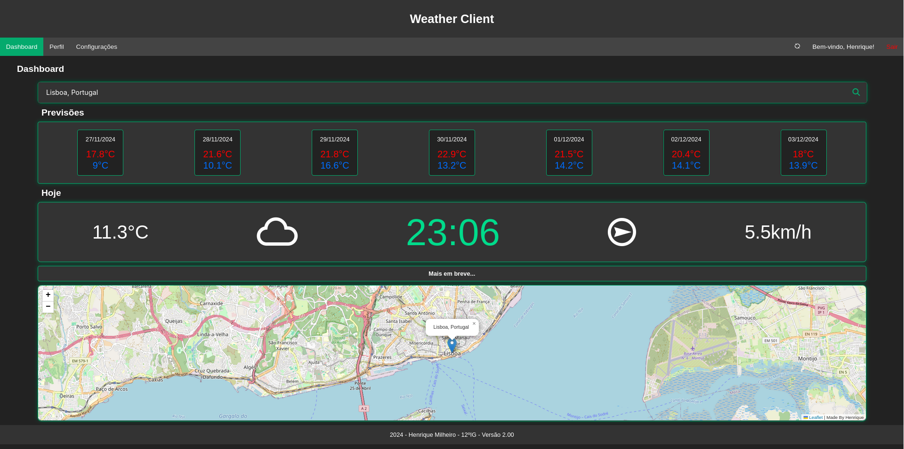
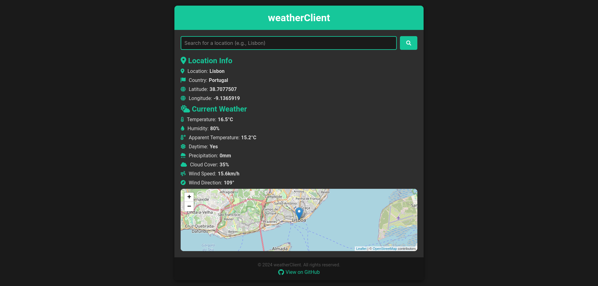

# weatherClient
WeatherClient was a website I coded in PHP and JavaScript, which I presented as my final project in school. This is just a recreation because the original code was very disorganized.

This project had a login system but I removed it in this recreated version, I don't think it's necessary as long as the project is not using API keys.

# Old Version

# New weatherClient

